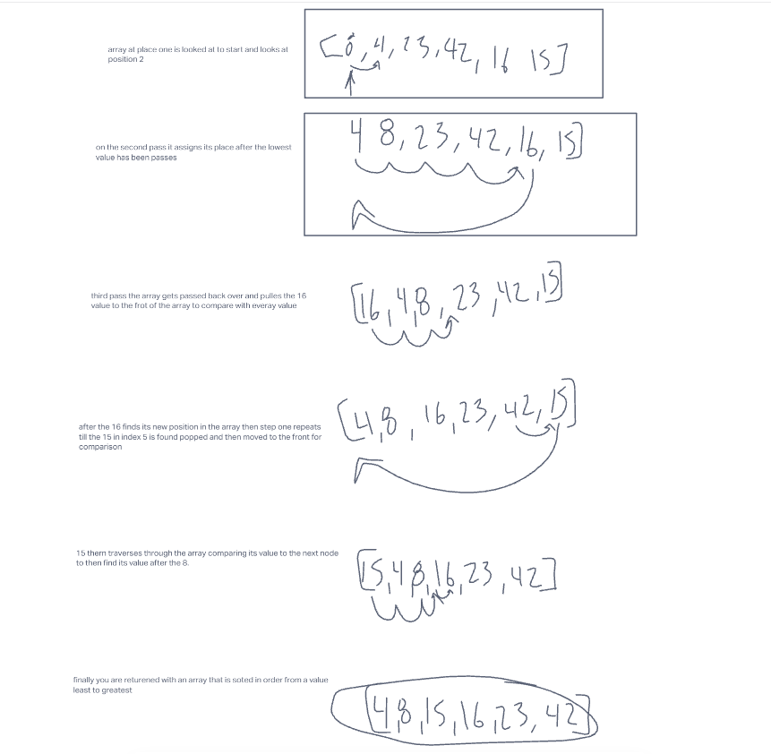

# code Challenge 26

## Insertion Sort

## blog

;

my understanding

- assign an empty array that you are able to push values into
- of that this solution needs to be able to start at the first index of the array and then the value of the first indext is checked to the next node
- as long of the value is less than the value of the current node you need to go to the next node
- when you reach the point of the value of the node being greater than the currant node then that will end the cycle and place that value into an array
- after all values have gone through return the the array from lowest to greatest

### after my work

- After finising i looked at what chatgpt would say about the code:

"
1. Set up a loop to iterate through the array, starting at the second element (index 1).

2. Inside the loop, create a variable j and set it equal to i-1. This will be used to track the position of the element we are inserting.

3. Create a variable temp and set it equal to the current element (arr[i]). This will be used to temporarily store the value of the current element while we shift other elements around.

4. Set up a nested loop to iterate through the array, starting at the element before the current element (arr[j]) and going backwards.

5. Inside the nested loop, check if j is greater than or equal to 0 and if temp is less than arr[j]. If both conditions are true, this means that the current element is smaller than the element before it, so we need to shift the elements around.

6. If the conditions are true, set arr[j+1] equal to arr[j]. This shifts the element at arr[j] one position to the right.

7. Decrement j by 1.

8. Repeat steps 5-7 until j is less than 0 or temp is greater than or equal to arr[j].

9. When the nested loop is finished, set arr[j+1] equal to temp. This inserts the current element into the correct position in the array.

10. Repeat the outer loop for each element in the array."

I feel that i had the right train of thought for translating the pseudocode and putting it into word or a rough algorithm that could be a possibility

