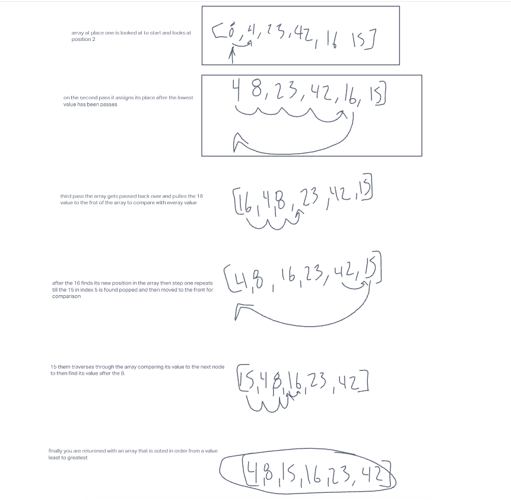

# code Challenge 27

## Merge sort

## blog

- from my understanding the array needsto be split in two halves
- then this needs to be done till vallues are all read
- compare values and assign left or right of the value
- return the aray of merged and sorted arrays
