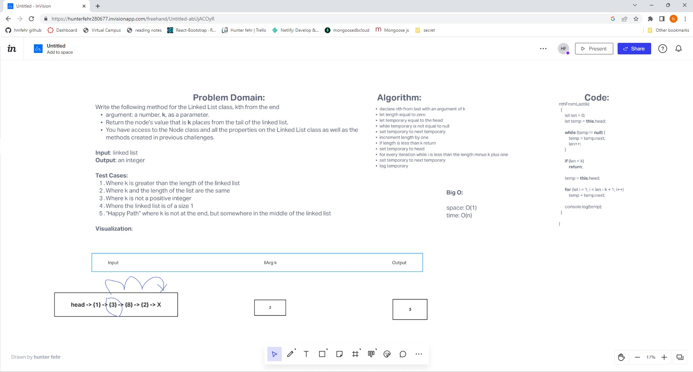

# k-th value from the end of a linked list

done with Steven Rejdukowski

## Challenge

Write the following method for the Linked List class:

* kth from end
  * argument: a number, k, as a parameter.
  * Return the node’s value that is k places from the tail of the linked list.
  * You have access to the Node class and all the properties on the Linked List class as well as the methods created in previous challenges.

## Approach & Efficiency
<!-- What approach did you take? Why? What is the Big O space/time for this approach? -->

## Solution
<!-- Embedded whiteboard image -->

## Requirements

Ensure your complete solution follows the standard requirements.

1. Write [unit tests](../../Challenge_Testing){:target="_blank"}
1. Follow the [template for a well-formatted README](../../Challenge_Documentation){:target="_blank"}
1. Submit the assignment following [these instructions](../../Challenge_Submission){:target="_blank"}

